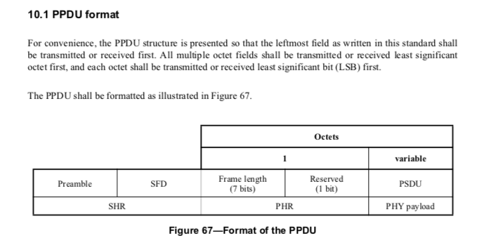
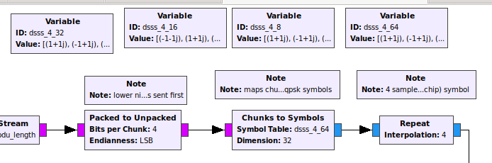
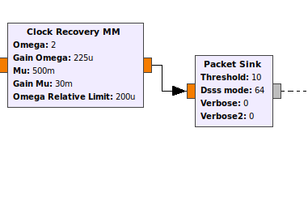

# Gnu Radio OQPSK DSSS Implements

## Description:

This mod implements PHY layer transmitting and receiving functionalities according the protocol [IEEE802.15.4](https://ieeexplore.ieee.org/document/6012487), which is also the physical layer of ZIgbee. This implementation mainly refers to a UCLA paper [GNU Radio 802.15.4 En- and Decoding](https://pdfs.semanticscholar.org/ebb5/c85bacf68b8da2c6aa054326101a7f9599f4.pdf) and a well-implemented OOT mod by Bastian Bloessl et al. (https://github.com/bastibl/gr-ieee802-15-4) 

This mod extends the basic OQPSK method by adding 4-8, 4-16, 4-32, 4-64 DSSS. 4-16 & 4-32 PN coding follows  [IEEE802.15.4 Std](https://ieeexplore.ieee.org/document/6012487) Table 73&74. 4-8 is obtained by slicing orignal 4-32 table, and 4-64 is obtained by concatenating 4-32 table. 

```python
signal_table8=[
                '00010101',
                '00010110',
                '00011001',
                '00011010',
                '00100101',
                '00100110',
                '00101001',
                '00101010',
                '11010101',
                '11010110',
                '11011001',
                '11011010',
                '11100101',
                '11100110',
                '11101001',
                '11101010']

signal_table64=[
                '1101100111000011010100100010111011011001110000110101001000101110',
                '1110110110011100001101010010001011101101100111000011010100100010',
                '0010111011011001110000110101001000101110110110011100001101010010',
                '0010001011101101100111000011010100100010111011011001110000110101',
                '0101001000101110110110011100001101010010001011101101100111000011',
                '0011010100100010111011011001110000110101001000101110110110011100',
                '1100001101010010001011101101100111000011010100100010111011011001',
                '1001110000110101001000101110110110011100001101010010001011101101',
                '1000110010010110000001110111101110001100100101100000011101111011',
                '1011100011001001011000000111011110111000110010010110000001110111',
                '0111101110001100100101100000011101111011100011001001011000000111',
                '0111011110111000110010010110000001110111101110001100100101100000',
                '0000011101111011100011001001011000000111011110111000110010010110',
                '0110000001110111101110001100100101100000011101111011100011001001',
                '1001011000000111011110111000110010010110000001110111101110001100',
                '1100100101100000011101111011100011001001011000000111011110111000'
                ]
```

For message format, this mod follows standard OQPSK PPDU structure:



## Files&Usage

This mod `oqpsk_dsss` contians two blocks  `preamble_code_prefixer` & `packet_sink` 

`preamble_code_prefixer` add SHR and PHR for input message.

`packet_sink` decode input float flow into orignal message.

To install, do following cmd:

```bash
mkdir build
cd build
cmake ..
make
sudo make install
sudo ldconfig
```

* /grc directory contains hier blocks of transmitter and receiver. It also contains a playground flow graph which you can turn up a UDP server and a  client to see how message is transmitting and receiving. Related command:

  ```bash
  nc -u 127.0.0.1 52003
  nc -u -l 127.0.0.1 52004
  ```

* /utils directory contains two convert python script which helps convert PN code table to desired data format. Details can be seen in ./utils/README.md

**HOW TO SWITCH DSSS:**

We take `oqpsk_dsss_playground.grc` for example:

If you want to use 4-64 DSSS, then you need modify 2 blocks in the graph:

1. **Chunk to Symbols**: change `Symbol Table` to `dsss_4_64` , `Dimension` to 32 (Dimension is always half of code length)

   

2. **Packet Sink**: change `dsss_mode` to 64. Note `Threshold` should at least smaller than half of code length (too large and too small will lead to poor performance.)

   
